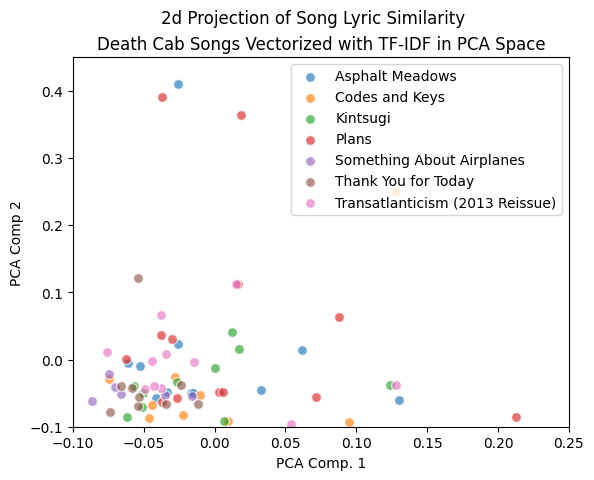
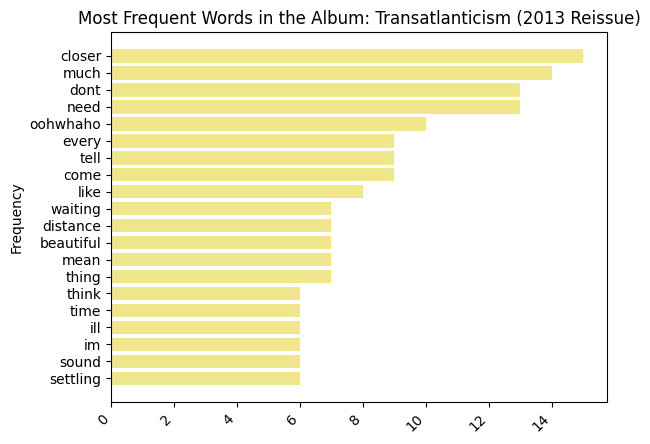

# Soul Meets Body (meets NLP)

```
"Oh come my love and swim with me,
Out in this vast Binary Sea"
- Death Cab for Cutie, Binary Sea
```

## Motivation 

1. Spotify told me I had listened to **12 hours of Death Cab for Cutie** in one week
2. I wanted to learn some NLP  

## Project overview (tl;dr)

> This project uses basic NLP to analyze lyrics and themes in songs from Death Cab for Cutie, The Postal Service, and Benjamin Gibbard's solo work.  


Lyrics collected using the Genius API. 

Lyrics written by Benjamin Gibbard, Death Cab for Cutie, and The Postal Service. 

Lyrics preprocessed and analzyed by the author (Lily). 

## Questions (?)

* How differently did Ben Gibbard write for Death Cab and the Postal Service? 
* How does Death Cab for Cutie's tone differ between albums?
* Can we take a song and predict if it was written for Death Cab or the Postal Service?

## Methods 
* TF-IDF Vectorization
* PCA for dimensionality reduction to get lyric similarity
* VADER, lexicon based, sentiment analysis 
* Word frequency (basic whitespace tokenization)

## Results (!)

Many songs written by Benjamin Gibbard across the three projects I looked at (DCFC, The Postal Service, and solo work) are similar in sentiment and vocabulary. 

Work within The Postal Service's only album, Give Up (2010), is especially lyrically cohesive.  

Lyrics across DCFC's discography is predictably more spread out than the other projects with regard to sentiment. 



>PCA was applied to a TF-IDF matrix to graphically represent songs in a 2-dimensional space. Points near each other share similar vocabular patterns. 


## Pipeline 
```
Genius API
   ↓
Raw Lyrics CSV
   ↓
Cleaning Script
   ↓
Processed Dataset
   ↓
NLP Analysis
   ↓
Visualizations
```

## Repository Structure

```
project/
│
├── data (not uploaded, copyright)
│   ├── raw
│   └── clean
|
├── docs 
│   ├── genAI_logs.pdf
|
|
|
├── src
│   ├── pull.py
│   ├── lyric_preprocessing.py
|   ├── modeling.py
|   ├── count.py
|   ├── sentiment.py
|   ├── visualizations.py
|
├── cleaning.ipynb
├── analysis.ipynb
|
├── requirements.txt
└── README.md
```
## Notes 

### On limitations, justifications, and improvements  

Limitations 
* small dataset (~200 songs)
* class imbalance (majority of observations are DCFC)

I include additional brief writing on these topics in the `analysis.ipynb` notebook. 

### On not infringing copyrights 

To respect copyright laws and Death Cab, I avoided including the full raw / clean data in this repository as full lyrics are present.  Included instead is the derived values (sentiment score and PCA components) 

By running the `pull.py` script, you can get the raw data, which can be run through the `cleaning.ipynb` notebook. 

### On Learning and GenAI Usage 

Still learning. Used resources like Youtube to understand concepts and follow tutorials. **If you have any feedback, please reach out! I would really value more insight**

I used ChatGPT primariy for code debugging, concept understanding, and learning best practices. All code, even that suggested from ChatGPT, is handtyped (admittidly inefficient) because I wanted to understand every line. For GenAI logs, please see the `\docs` folder. 

All writing is mine (for better or worse). 

### On reproducibility 

Clone this repository: 

```
git clone https://github.com/lily-harper/death-cab-lyrics-nlp 
```

```python
python -m venv .venv
source .venv/bin/activate
pip install -r requirements.txt
```



Most frequent words in the Death Cab album, Transcatlanticism. 

## Conclusion 

This project was done as a personal dive into NLP on lyrics from bands I enjoy. 

The models are simple and the scope was small but this was end to end completed by me. The goal was to learn more about the ds/ml workflow and create a reproducible pipeline.